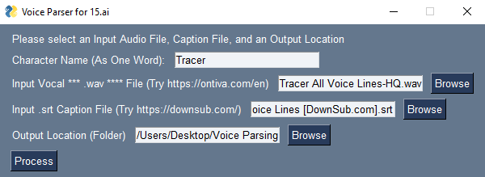

# Unofficial Voice Data 15.ai Preprocesser

This is a simple voice preprocessing solution designed to smooth out the workflow for importing vocal datasets into 15.ai



## Preparation

In order continue we will need to independently acquire a WAV file recording of various lines, and an accompanying SRT caption file from that clip. 

For the purposes of this project, I have been testing by downloading videos and captions from Youtube's automatic captioning system. 

>For the WAV File: https://ontiva.com/en  
>For the SRT Captioning File: https://downsub.com/

## Instructions

First we need to open a CMD window and run:

>```pip install scipy numpy PySimpleGUI```

Then we need to navigate to the directory of this project file in a CMD window, and run:

>```python Voiceparser.py```


To finish off, we will need to input the audio and captioning file into the GUI of Voiceparser to process them into a more digestible dataset for language processing. These can then be cleaned up in Notepad and Audacity.

Sample Video I had decent results with:  
https://www.youtube.com/watch?v=23HdsSDZMws 

### Known Issues
Youtube's automatic captioning and timestamps very often cut off in the middle of a spoken word. This makes a relatively messy dataset; which still needs to be cleaned up by hand. This process is far and away simpler than preparing the _entire_ thing by hand however.

### Disclaimer
>This is a one-off project; please dont expect support or maintenance in the future.